  

I build backend systems, mostly in Rust these days, after a long stretch of .NET enterprise apps. I like software that is fast, boring to operate, and honest about its failure modes.

  

## What I'm into

- **Rust on the server** - Axum, Tokio, SQLx, tonic. Async services that stay predictable under load.
- **Low-latency & systems work** - rate limiting, protocol overhead, measuring before optimizing. Growing into C++ for the hot paths.
- **Distributed backends** - microservices, background jobs, pub/sub, relationship-based access control.
- **Picking the right store** - Postgres first, then ScyllaDB, Redis, or MongoDB when the data shape asks for it.
- **LLM-assisted development & workflow automation** - tools that take the busywork out of coding: code search, commit messages, scripts.

## System design in practice

`rate limiting` · `async job queues` · `caching` · `pub/sub` · `real-time over WebSocket` · `polyglot persistence` · `ReBAC authorization` · `service-to-service gRPC`

## Things I've built

| Project | What it is |
|---|---|
| [portal-app](https://github.com/gianged/portal-app) | Full-stack Rust company portal: projects, tickets, attendance, real-time chat. Axum, Leptos/WASM, OpenFGA, Postgres, ScyllaDB, Redis |
| [cindex](https://github.com/gianged/cindex) | Semantic code search over large codebases for AI coding tools, tree-sitter + embeddings |
| [universal-commit-assistant](https://github.com/gianged/universal-commit-assistant) | VS Code extension that writes commit messages with your choice of AI provider |
| [sdf-converter](https://github.com/gianged/sdf-converter) | CLI that dumps SQL Server Compact `.sdf` files to SQL for other databases |
| [gianged-attendance](https://github.com/gianged/gianged-attendance) | Desktop app syncing ZKTeco fingerprint scanners to Postgres, with Excel reports |

## Toolbox

